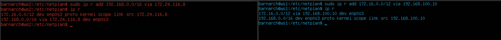
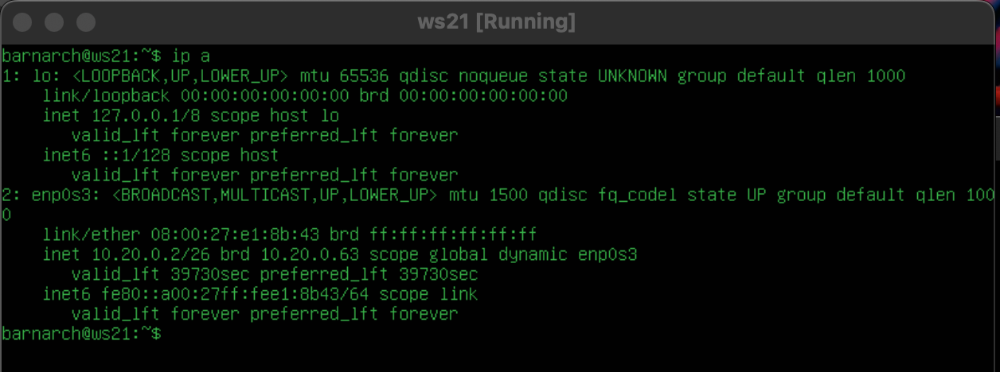

# Part 1. Инструмент ipcalc  

#### 1.1. Сети и маски  
`1.` Определить адрес сети 192.167.38.54/13  
***Ответ:*** 192.160.0.0./13  
`2.` Совершить перевод маски 255.255.255.0 в префиксную и двоичную запись, /15 в обычную и двоичную, 11111111.11111111.11111111.11110000 в обычную и префиксную   
***Ответ:***  
    `-` маска 255.255.255.0 префиксная: ***/24***  
    `-` маска 255.255.255.0 двоичная: ***11111111.11111111.11111111.0000000***  
    `-` маска /15 двоичная: ***11111111.11111110.0000000.00000000***  
    `-` маска /15 обычная: ***255.254.0.0***  
    `-` маска 11111111.11111111.11111111.11110000 префиксная: ***/28***  
    `-` маска 11111111.11111111.11111111.11110000 обычная: ***255.255.255.240***  
`3.` Определить минимальный и максимальный хост в сети 12.167.38.4 при масках: /8, 11111111.11111111.00000000.00000000, 255.255.254.0 и /4  
***Ответ:***  
    `-` минимальный хост сети 12.167.38.4 при маске /8: ***12.0.0.1***  
    `-` максимальный хост сети 12.167.38.4 при маске /8: ***12.255.255.254***  
    `-` минимальный хост сети 12.167.38.4 при маске /16 (11111111.11111111.00000000.00000000): ***12.167.0.1***  
    `-` максимальный хост сети 12.167.38.4 при маске /16 (11111111.11111111.00000000.00000000): ***12.167.255.254***  
    `-` минимальный хост сети 12.167.38.4 при маске /23 (255.255.254.0): ***12.167.38.1***  
    `-` максимальный хост сети 12.167.38.4 при маске /23 (255.255.254.0): ***12.167.39.254***  
    `-` минимальный хост сети 12.167.38.4 при маске /4: ***0.0.0.1***  
    `-` максимальный хост сети 12.167.38.4 при маске /4: ***15.255.255.254***  

#### 1.2. localhost  
Определить и записать в отчёт, можно ли обратиться к приложению, работающему на localhost, со следующими IP: 194.34.23.100, 127.0.0.2, 127.1.0.1, 128.0.0.1  
***Ответ:***  
Поскольку диапазон сети localhost - это 127.0.0.0, а также:  
    `-` минимальный хост сети 127.0.0.0 при маске /8: 127.0.0.1  
    `-` максимальный хост сети 127.0.0.0 при маске /8: 127.255.255.254  
*Значит мы можем обратиться к приложению, работающему на localhost с IP:* ***127.0.0.2, 127.1.0.1***  

#### 1.3. Диапазоны и сегменты сетей  
`1.` Определить какие из перечисленных IP можно использовать в качестве публичного, а какие только в качестве частных: 10.0.0.45, 134.43.0.2, 192.168.4.2, 172.20.250.4, 172.0.2.1, 192.172.0.1, 172.68.0.2, 172.16.255.255, 10.10.10.10, 192.169.168.1
***Ответ:***  
    `-` Публичные IP всегда делат в диапазоне адресов:  
        ***134.43.0.2, 172.0.2.1, 172.68.0.2, 192.172.0.1, 192.169.168.1***  
    `-` Частные IP всегда лежат в дапазонах адресов 10.0.0.0/8, 172.16.0.0./12, 192.168.0.0/16:  
        ***10.0.0.45, 10.10.10.10, 172.20.250.4, 172.16.255.255, 192.168.4.2***  
`2.` Определить какие из перечисленных IP адресов шлюза возможны у сети 10.10.0.0/18: 10.0.0.1, 10.10.0.2, 10.10.10.10, 10.10.100.1, 10.10.1.255  
***Ответ:***  
    `-` 10.10.0.2  
    `-` 10.10.10.10  
    `-` 10.10.1.255  

# Part 2. Статическая маршрутизация между двумя машинами  

Разберёмся, как связать две машины, используя статическую маршрутизацию.  
Для этого поднимем две виртуальные машины (далее -- ws1 и ws2).  

#### 1. С помощью команды ip a посмотреть существующие сетевые интерфейсы  
В отчёт поместить скрин с вызовом и выводом использованной команды:  
      

#### 2. Описать сетевой интерфейс, соответствующий внутренней сети, на обеих машинах и задать следующие адреса и маски: ws1 - 192.168.100.10, маска /16, ws2 - 172.24.116.8, маска /12  
В отчёт поместить скрины с содержанием изменённого файла `etc/netplan/00-installer-config.yaml` для каждой машины.  
Выполнить команду netplan apply для перезапуска сервиса сети:  
      
 

#### 2.1. Добавление статического маршрута вручную  
`1.` Добавить статический маршрут от одной машины до другой и обратно при помощи команды вида `ip r add`:  
     
`2.` Пропинговать соединение между машинами:  
     

#### 2.2. Добавление статического маршрута с сохранением  
Перезапустить машины  
Добавить статический маршрут от одной машины до другой с помощью файла `etc/netplan/00-installer-config.yaml`  
В отчёт поместить скрин с содержанием изменённого файла `etc/netplan/00-installer-config.yaml`.  
Пропинговать соединение между машинами  
***Ответ:***  
     

# Part 3. Утилита iperf3  

#### 3.1. Скорость соединения
Перевести и записать в отчёт: `8 Mbps в MB/s`, `100 MB/s в Kbps`, `1 Gbps в Mbps`.
`1.` 8 Mbps в MB/s:
    Для этого нам нужно разделить скорость в мегабитах в секунду (Mbps) на 8, так как 1 байт (B) состоит из 8 бит (b).  
    8 Mbps / 8 = 1 MB/s  
    ***Ответ:***  8 Mbps равно 1 MB/s.  

`2.`100 MB/s в Kbps:
    Для этого нам нужно умножить скорость в мегабайтах в секунду (MB/s) на 1000, так как 1 мегабайт (MB) состоит из 1000 килобайт (KB).  
    100 MB/s * 8 * 1000 = 800 000 Kbps  
    ***Ответ:***  100 MB/s равно 800 000 Kbps.  

`3.` 1 Gbps в Mbps:
    Для этого нам нужно умножить скорость в гигабитах в секунду (Gbps) на 1000, так как 1 гигабит (Gbps) состоит из 1000 мегабит (Mbps).  
    1 Gbps * 1000 = 1000 Mbps  
    ***Ответ:***  1 Gbps равно 1000 Mbps.  

#### 3.2. Утилита iperf3
Измерить скорость соединения между ws1 и ws2  
***Ответ:***  
     

# Part 4. Сетевой экран  

#### 4.1. Утилита iptables

Утилита **iptables** — утилита командной строки, является стандартным интерфейсом управления работой межсетевого экрана (Firewall).  

`1.` Посмотрим состяние машин командой `sudo iptables -L -nv`, где -L означает режим списка правил, а опции -nv выводят подробный отчет в цифрах:
     
В выводе видим три цепочки INPUT, FORWARD, OUTPUT. Первая цепочка отвечает за входящие пакеты извне.
Поскольку мы не видим никаких органичивающих на вход правил, то значит на машинах не установлены барьеры (Firewall-ы).

Далее посмотрим какие службы используют машины и какие порты они слушают через команду `sudo ss -ntupl` (аналог netstat):
     

В клолонке Local Address:Port есть сокет 0.0.0.0 c портом 47619, что означает, что любой IPv4 адрес может подключиться к машине через 47619 порт - это не безопасно.

`2.` Создаем файл `/etc/firewall.sh`, имитирующий фаерволл, на ws1 и ws2.  
Нужно добавить в файл подряд следующие правила:  
1) на ws1 применить стратегию когда в начале пишется запрещающее правило, а в конце пишется разрешающее правило (это касается пунктов 4 и 5)  
2) на ws2 применить стратегию когда в начале пишется разрешающее правило, а в конце пишется запрещающее правило (это касается пунктов 4 и 5)  
3) открыть на машинах доступ для порта 22 (ssh) и порта 80 (http)  
4) запретить echo reply (машина не должна "пинговаться”, т.е. должна быть блокировка на OUTPUT)  
5) разрешить echo reply (машина должна "пинговаться")  

`3.` Запускаем файлы на обеих машинах командами `chmod +x /etc/firewall.sh` и `/etc/firewall.sh`  
     

`4.` Разница между стратегиями, применёнными в первом и втором файлах.  
***Ответ:***  
    `-` ACCEPT - разрешить прохождение пакета дальше по цепочке правил;  
    `-` REJECT - отклонить пакет, отправителю будет отправлено сообщение, что пакет был отклонен;  

Утилита iptables выполняет первое прочитанное правило.
Таким образом, разница между стратегиями заключается в порядке команд.  
Машине ws1 первой командой задан **REJECT**, то есть отклонение пакетов - будет выполнятся запрет и пинг не сработает. У машины **ws2** напротив, первым стоит **ACCEPT** - разрешить прохождение пакета, благодаря чему пинг пройдет.  

#### 4.2. Утилита nmap

`1.` Командой ping найти машину, которая не "пингуется", после чего утилитой nmap показать, что хост машины запущен.  
Проверка: в выводе nmap должно быть сказано: `Host is up`.  

***Ответ:***  
Пропингуем ws2, потому что на машине ws1 установлен Firewall, блокирующий процедуру пингования.  
В отчёт поместить скрины с вызовом и выводом использованных команд ping и nmap.  
     

# Part 5. Статическая маршрутизация сети

Поднять пять виртуальных машин (3 рабочие станции (ws11, ws21, ws22) и 2 роутера (r1, r2))

### 5.1. Настройка адресов машин

`1.` Настроить конфигурации машин в `etc/netplan/00-installer-config.yaml`согласно сети на рисунке.  
В отчёт поместить скрины с содержанием файла `etc/netplan/00-installer-config.yaml` для каждой машины.  
      

`2.` Перезапустить сервис сети. Если ошибок нет, то командой `ip -4 a` проверить, что адрес машины задан верно. 
      

`3.` Также пропинговать ws22 с ws21. Аналогично пропинговать r1 с ws11.  
      
      

### 5.2. Включение переадресации IP-адресов.

`1.` Для включения переадресации IP, выполните команду на роутерах:
`sysctl -w net.ipv4.ip_forward=1`  
    При таком подходе переадресация не будет работать после перезагрузки системы.  
      

`2.` Откройте файл `/etc/sysctl.conf` и добавьте в него следующую строку:  
    `net.ipv4.ip_forward = 1`  
    При использовании этого подхода, IP-переадресация включена на постоянной основе.  
      

### 5.3. Установка маршрута по-умолчанию

`1.` Настроить маршрут по-умолчанию (шлюз) для рабочих станций. Для этого добавить `default` перед IP роутера в файле конфигураций.  

`2.` Вызвать ip r и показать, что добавился маршрут в таблицу маршрутизации.  
      

`3.` Пропинговать с ws11 роутер r2 и показать на r2, что пинг доходит. Для этого использовать команду: `tcpdump -tn -i eth1`.  
      
      

### 5.4. Добавление статических маршрутов  

`1.` Добавить в роутеры r1 и r2 статические маршруты в файле конфигураций.  
`2.` Вызвать ip r и показать таблицы с маршрутами на обоих роутерах.  
      

`3.` Запустить команды на ws11:  
`ip r list 10.10.0.0/[маска сети]` и `ip r list 0.0.0.0/0`.  
      

- Почему для адреса `10.10.0.0/18` был выбран маршрут, отличный от 0.0.0.0/0, хотя он попадает под маршрут по-умолчанию?  
    Для адреса `10.10.0.0/18` был выбран более конкретный маршрут, чем маршрут по умолчанию (**0.0.0.0/0**). Маршрут с более длинной маской подсети (**10.10.0.0/18**) имеет более высокий приоритет и предпочтительнее для доставки трафика к этой конкретной подсети. Маршрут **0.0.0.0/0** используется в случае, когда нет конкретных маршрутов для отправки пакета в определенное место.

### 5.5. Построение списка маршрутизаторов

`1.` Запустить на r1 команду дампа `sudo tcpdump -tnv -i enp0s3`:  
      

`2.` При помощи утилиты traceroute построить список маршрутизаторов на пути от ws11 до ws21:  
      

`3.` В отчёте, опираясь на вывод, полученный из дампа на r1, объяснить принцип работы построения пути при помощи traceroute.

- На рабочей станции (на исходном узеле) запускается утилита traceroute. Благодаря этому начинают отправляться серии ICMP или UDP пакетов к целевому узлу с инкрементирующимися значениями TTL (Time-to-Live), начиная с 1. 
TTL - это поле в заголовке IP-пакета, которое ограничивает количество "прыжков" или узлов между маршрутизаторами, которые может совершить пакет, прежде чем он будет отброшен.
Утилита traceroute определяет все маршруты, которые надо пройти, чтобы дойти до получателя.  

- Первый пакет (с TTL = 1) отправляется к ближайшему маршрутизатору на пути к целевому узлу. Когда первый маршрутизатор получает пакет с TTL = 1 (время жизни 1), он уменьшает TTL до 0 и отбрасывает пакет . Затем маршрутизатор отправляет уведомление о "время жизни пакета истекло" (Time Exceeded) обратно отправителю.  

- Исходный узел получает это уведомление и записывает IP-адрес маршрутизатора, который обработал пакет, а также измеряет задержку до этого маршрутизатора.  

- Затем процедура повторяется, увеличивая TTL на 1. Это позволяет пакету дойти до следующего маршрутизатора на пути, и таким образом, каждый маршрутизатор на пути к целевому узлу записывается.  

- Процесс повторяется до тех пор, пока пакет не достигнет целевого узла. Когда это произойдет, целевой узел отправит `echo`-ответ, и traceroute завершит выполнение.  

### 5.6. Использование протокола ICMP при маршрутизации

`1.` Запустить на r1 перехват сетевого трафика, проходящего через eth0 с помощью команды `tcpdump -n -i eth0 icmp`:  
      

`2.` Пропинговать с ws11 несуществующий IP (например, 10.30.0.111) с помощ0ью команды `ping -c 1 10.30.0.111`:  
      

# Part 6. Динамическая настройка IP с помощью DHCP  

### 1. Для r2 настроить в файле /etc/dhcp/dhcpd.conf конфигурацию службы DHCP:

`1.` Указать адрес маршрутизатора по-умолчанию, DNS-сервер и адрес внутренней сети.  
      

`2.` В файле resolv.conf прописать nameserver 8.8.8.8.
      

### 2. Перезагрузить службу DHCP 
`1.` Выполнить перезапуск командой `systemctl restart isc-dhcp-server`.  
      
`2.` Машину ws21 перезагрузить при помощи `reboot` и через `ip a` показать, что она получила адрес.  
До перезапуска:  
      
После перезапуска:  
      
`3.` Также пропинговать ws22 с ws21.  
      

### 3. Указать MAC адрес у ws11  
`1.` В файле etc/netplan/00-installer-confg.yaml добавить строки: 
      

### 4. Для r1 настроить аналогично r2, но сделать выдачу адресов с жесткой привязкой к MAC-адресу (ws11). 
`1.` Настройка конфигурации службы DHCP:  
      
      

`2.` Запросить с ws21 обновление ip адреса:  
IP-адрес до изменений:  
      
После изменений:  
      

`3.` Пропинговать ws22 с ws21.  
      

`4.` Какими опциями DHCP сервера вы пользовались в данном пункте?  
В данной части проекта пользовалась двумя опциями DHCP сервера:  
 - `dhclient -r` для удаления всех старых ip  
 - `dhclient -v ` для запроса нового ip  

# Part 7. NAT

### 1. В файле /etc/apache2/ports.conf на ws22 и r1 изменить строку Listen 80 на Listen 0.0.0.0:80, то есть сделать сервер Apache2 общедоступным.  
Изменения для роутера r1:  
      
Изменения для рабочей станции ws22:  
      

### 2. Запустить веб-сервер Apache 
Используем команду `service apache2 start` на r1:  
      
Используем команду `service apache2 start` на ws22:  
      

### 3. Добавить в фаервол на r2 со следующими правилами:  

1) Удаление правил в таблице filter - ***iptables -F***  
2) Удаление правил в таблице "NAT" - ***iptables -F -t nat***  
3) Отбрасывать все маршрутизируемые пакеты - ***iptables --policy FORWARD DROP***  

    Фаервол на роутере r2:  
      

    Проверить соединение между ws22 и r1 командой ping:  
    ***При запуске файла с этими правилами, ws22 не должна "пинговаться" с r1***   
      

Добавить в файл ещё одно правило:  

4) Разрешить маршрутизацию всех пакетов протокола ICMP  
      

    Проверить соединение между ws22 и r1 командой ping:  
    ***При запуске файла с этими правилами, ws22 должна "пинговаться" с r1***   
      

Добавить в файл ещё два правила:  

5) Включить SNAT, а именно маскирование всех локальных ip из локальной сети, находящейся за r2 (по обозначениям из Части 5 - сеть 10.20.0.0)  
    ***Совет: стоит подумать о маршрутизации внутренних пакетов, а также внешних пакетов с установленным соединением***  
      

6) Включить DNAT на 8080 порт машины r2 и добавить к веб-серверу Apache, запущенному на ws22, доступ извне сети  
    ***Совет: стоит учесть, что при попытке подключения возникнет новое tcp-соединение, предназначенное ws22 и 80 порту***  
      

### 4. Проверить соединение по TCP для SNAT  
Для проверки  нужно с рабочей станции ws22 подключиться к серверу Apache на r1 командой `telnet [IP-адрес r1] [порт]`:  
      

### 5. Проверить соединение по TCP для DNAT  
Для проверки  нужно с роутера r1 подключиться к серверу Apache на ws22 командой telnet (обращаться по IP-адресу r2 и порту 8080):  
      

# Part 8. Дополнительно. Знакомство с SSH Tunnels  

`1.` Запустить на r2 фаервол с правилами из Части 7:  
      

`2.` Запустить веб-сервер Apache на ws22 только на localhost (то есть в файле /etc/apache2/ports.conf изменить строку Listen 80 на Listen  localhost:80):  
      
      

`3.` Воспользоваться **Local TCP forwarding** с ws21 до ws22, чтобы получить доступ к веб-серверу на ws22 с ws21. На машине ws21 вводим команду `sudo ssh -L 8080:localhost:80 barnarch@10.20.0.20`.  
Проверяем сработало ли подключение с помощью telnet:  
      

`4.` Воспользоваться **Remote TCP forwarding** c ws11 до ws22, чтобы получить доступ к веб-серверу на ws22 с ws11.  
Для этого надо установить соединение в обратном направлении - на машине ws22 вводим команду `sudo ssh -R 8080:localhost:80 barnarch@10.20.0.6` и подключаемся к ws11:  
      
    
После проверяем сработало ли подключение с помощью telnet на машине ws11:  
      
