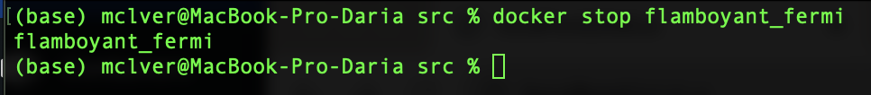

# Part 1. Готовый докер  

`1.` Взять официальный докер образ с nginx и выкачать его при помощи `docker pull ` 
      

`2.` Проверить наличие докер образа через `docker images ` 
      

`3.` Запустить докер образ через `docker run -d [image_id|repository]  `
      

`4.` Проверить, что образ запустился через `docker ps `  
      

`5.` Посмотреть информацию о контейнере через `docker inspect [container_id|container_name]`  
      

`6.` По выводу команды определить и поместить в отчёт размер контейнера, список замапленных портов и ip контейнера  
Размер контейнера:  
      

Список замапленных портов:  
      
    
Список ip контейнера:  
      

`7.` Остановить докер образ через `docker stop [container_id|container_name]`  
      

`8.` Проверить, что образ остановился через `docker ps`  
      

`9.` Запустить докер с портами 80 и 443 в контейнере, замапленными на такие же порты на локальной машине, через команду `run`  
      

`10.` Проверить, что в браузере по адресу `localhost:80` доступна стартовая страница nginx  
      

`11.` Перезапустить докер контейнер через `docker restart [container_id|container_name]`  
      

`12.` Проверить любым способом, что контейнер запустился  
      

# Part 2. Операции с контейнером  

`1.` Прочитать конфигурационный файл nginx.conf внутри докер контейнера через команду exec  
      

`2.` Создать на локальной машине файл nginx.conf  
`3.` Настроить в нем по пути /status отдачу страницы статуса сервера nginx  
      

`4.` Скопировать созданный файл nginx.conf внутрь докер образа через команду docker cp  
      

`5.` Перезапустить nginx внутри докер образа через команду exec  
      

`6.` Проверить, что по адресу localhost:80/status отдается страничка со статусом сервера nginx  
      

`7.` Экспортировать контейнер в файл container.tar через команду export  
      

`8.` Остановить контейнер  
      

`9.` Удалить образ через docker rmi [image_id|repository], не удаляя перед этим контейнеры  
      

`10.` Удалить остановленный контейнер  
      

`11.` Импортировать контейнер обратно через команду import  
      

`12.` Запустить импортированный контейнер  
      

`13.` Проверить, что по адресу localhost:80/status отдается страничка со статусом сервера nginx  
      

# Part 3. Мини веб-сервер  

`1.` Написать мини сервер на C и FastCgi, который будет возвращать простейшую страничку с надписью `Hello World`!  
      

`2.` Написать свой `nginx.conf`, который будет проксировать все запросы с 81 порта на 127.0.0.1:8080  
       

`3.` Запуск мини сервера через `spawn-fcgi` на порту 8080  
      

Копируем в контейнер мини сервер:
      

Заходим в контейнер с помощью команды `docker exec -it [comtainer_name] bash`.  
      

После обновляем репозиторий и устанавливаем gcc, spawn-fcgi и libfcgi-dev:  
      

Компилируем и запускаем мини сервер:  
      

`4.` Проверить, что в браузере по `localhost:81` отдается написанная вами страничка  
      

# Part 4. Свой докер  

`1.` Написать `свой докер образ`, который:

    1) собирает исходники мини сервера на FastCgi из Части 3
    2) запускает его на 8080 порту
    3) копирует внутрь образа написанный ./nginx/nginx.conf
    4) запускает nginx.
Мой докер:  
      

Мой entrypoint скрипт:
      

`2.` Собрать написанный докер образ через `docker build` при этом указав имя и тег
      

`3.` Проверить через docker images, что все собралось корректно
      

`4.` Запустить собранный докер образ с маппингом 81 порта на 80 на локальной машине и маппингом папки ./nginx внутрь контейнера по адресу, где лежат конфигурационные файлы nginx'а (см. Часть 2). Команда: `sudo docker run -p 80:81 -v /Users/mclver/Desktop/DO5_SimpleDocker-1/src/part4/nginx/:/etc/nginx/ -d miniserver:latest`  
      

`5.` Проверить, что по `localhost:80` доступна страничка написанного мини сервера  
      

`6.` Дописать в ./nginx/nginx.conf проксирование странички /status, по которой надо отдавать статус сервера nginx  
      

`7.` Перезапустить докер образ  
      

`8.` Проверить, что теперь по localhost:80/status отдается страничка со статусом nginx
      

# Part 5. Dockle  

`1.` Просканировать образ из предыдущего задания через dockle [image_id|repository]  
      

`2.` Исправить образ так, чтобы при проверке через dockle не было ошибок и предупреждений  
- Меняем Dockerfile
- Повторно сканируем
      

`3.` Проверяем:
      

# Part 6. Базовый Docker Compose  

1) Поднять докер контейнер из Части 5 (он должен работать в локальной сети, т.е. не нужно использовать инструкцию EXPOSE и мапить порты на локальную машину)
2) Поднять докер контейнер с nginx, который будет проксировать все запросы с 8080 порта на 81 порт первого контейнера

Замапить 8080 порт второго контейнера на 80 порт локальной машины

- Создадим файл nginx.conf:  
      
    
- Создадим файл entrypoint.sh:  
      

- Создадим docker-compose.yml:  
      

Остановить все запущенные контейнеры  
      

Собрать проект с помощью команды `docker-compose build`  
      

Запустить проект с помощью команды `docker-compose up`  
      

Проверить, что в браузере по localhost:80 отдается написанная вами страничка, как и ранее  
      
